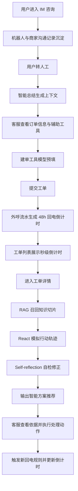

## 1. 产品概述
人工客服工作台演示系统面向客服、质检、运营、商家服务和管理层，集中展示 IM 在线接待、工单处理、智能方案推荐与 RAG 知识召回链路。
- 主要目标是用高保真前端 Demo 呈现“模型辅助客服研判、建单、回电管理、方案生成”的完整工作流，适合向不同部门老板做汇报演示。
- 产品价值是降低客服理解上下文、查找知识、维护回电节奏和输出处理方案的成本，并把复杂 AI 链路转化为可解释、可展示的业务界面。

## 2. 核心功能

### 2.1 用户角色
| 角色 | 使用方式 | 核心权限 |
|------|----------|----------|
| 一线客服 | 进入在线工作台和工单工作台 | 接待 IM、查看智能总结、修改模型预填建单字段、处理工单、查看方案推荐 |
| 客服主管 | 进入所有演示页面 | 查看整体工单 SLA、回电倒计时、智能推荐依据和处理链路 |
| 运营/产品/算法观众 | 演示浏览 | 查看 RAG 切片、React 推理步骤、Self-reflection 自检结果和知识引用解释 |

### 2.2 功能模块
1. **在线工作台**：会话列表、IM 对话流、智能总结、订单信息辅助区、工具区、建单抽屉。
2. **工单列表页**：工单筛选、工单表格、秒级回电倒计时、状态标签、流水摘要、优先级和分页。
3. **工单详情页**：工单基础信息、左侧智能方案推荐、知识依据浮窗、方案结论解释浮窗、工单流水、回电规则倒计时。
4. **RAG 切片知识库页**：文档标题、文档总结、场景、切片内容、定位符、定位字段、完整召回场景。
5. **AI 链路演示区**：展示 RAG 召回、React 行动轨迹、Self-reflection 自检与最终方案融合过程，不依赖真实大模型或 Coze 链路。

### 2.3 页面详情
| 页面名称 | 模块名称 | 功能描述 |
|----------|----------|----------|
| 在线工作台 | 会话队列 | 展示待接入、处理中、已超时、待回访等会话分组，支持选中会话切换主工作区内容 |
| 在线工作台 | 智能总结 | 位于对话流顶部，大标题描述用户诉求，下方按“用户诉求、商家沟通记录、工单记录”三块总结转人工信息 |
| 在线工作台 | IM 对话流 | 展示用户、机器人、客服、系统卡片消息，突出订单卡、转人工节点和客服回复 |
| 在线工作台 | 客服辅助区 | 右侧上方使用 Tab 展示订单信息、用户画像、售后记录、知识命中，默认选中订单信息 |
| 在线工作台 | 工具区 | 右侧下方展示快捷工具，包含“建单工具”，点击后打开抽屉或浮层 |
| 在线工作台 | 建单工具 | 展示工单分类、用户诉求、工单类型、备注四个字段，均由模型预填，客服可编辑和提交 |
| 工单列表页 | 回电倒计时 | 每条工单前展示精确到秒的倒计时，用颜色区分正常、临近、超时 |
| 工单列表页 | 工单表格 | 展示工单标题、分类、用户诉求、处理人、状态、下一次回电时间、最近流水、优先级 |
| 工单详情页 | 智能方案推荐 | 左侧顶部展示用户问题、用户诉求、举证情况、知识依据、方案指引 |
| 工单详情页 | 知识依据浮窗 | 点击知识依据引用文本，浮窗展示模型输出的知识库原文、命中片段、定位字段和可信度 |
| 工单详情页 | 方案指引浮窗 | 点击方案结论，浮窗展示模型生成的简短 COT 风格解释，用于演示“为什么给出该建议” |
| 工单详情页 | 工单信息区 | 展示工单分类标题和同款回电倒计时，辅助客服感知当前回访节奏 |
| 工单详情页 | 工单流水 | 展示外呼自动生成 48h 倒计时、动作触发规则、倒计时调整等样例流水 |
| RAG 切片知识库页 | 切片列表 | 展示文档标题、文档总结、场景、切片内容、定位符、定位字段、完整召回场景 |
| RAG 切片知识库页 | 召回详情 | 展示切片被命中的原因、关联工单、相似问题和引用位置 |
| AI 链路演示区 | RAG/React/Self-reflection | 用静态模拟数据展示检索、行动、反思、修正、输出方案的流程和状态 |

## 3. 核心流程
客服从 IM 接入用户，系统先汇总用户转人工前的上下文；客服判断需要沉淀为工单时，打开模型预填的建单工具并提交。工单进入列表后，外呼流水自动生成一轮 48h 回电倒计时；后续客服动作触发新的回电规则并刷新倒计时。在工单详情中，系统通过 RAG 知识召回和模拟推理链路生成智能方案，客服可查看知识依据、方案解释和流水来源。

## 4. 用户界面设计

### 4.1 设计风格
- **整体方向**：企业级高密度智能工作台，强调“可汇报、可信任、可解释”的 AI 辅助感。
- **主色**：深青绿色 `#0F766E`，代表客服效率和业务稳定；辅助色使用青蓝 `#0891B2`、琥珀 `#F59E0B`、危险红 `#DC2626` 表达状态。
- **背景**：浅灰蓝底色叠加细网格、柔和卡片阴影和半透明分区，形成专业 SaaS 控制台质感。
- **字体**：优先使用中文友好的现代无衬线字体栈，标题加粗、数字倒计时使用等宽数字，增强 SLA 紧迫感。
- **布局**：桌面优先，在线工作台采用左会话列表 + 中央对话流 + 右辅助区三栏；工单页采用左侧智能推荐 + 右侧详情/流水的双栏结构。
- **交互**：Tab、抽屉、浮窗、倒计时、步骤条和状态胶囊均需要真实可交互，便于演示时点击展示。

### 4.2 页面设计概览
| 页面名称 | 模块名称 | UI 元素 |
|----------|----------|---------|
| 在线工作台 | 智能总结 | 顶部渐变卡片、诉求标题、三列摘要、风险标签、模型生成标识 |
| 在线工作台 | IM 对话流 | 左右气泡、订单卡片、转人工系统条、客服输入区、快捷回复按钮 |
| 在线工作台 | 客服辅助区 | 订单卡、履约信息、商品信息、售后节点、标签式 Tab |
| 在线工作台 | 建单工具 | 右侧抽屉、可编辑表单、模型预填标识、字段置信度、提交按钮 |
| 工单列表页 | 倒计时表格 | 秒级数字、环形进度、临近变色、分类和状态胶囊 |
| 工单详情页 | 智能方案推荐 | 重点卡片、分段信息、引用链接、可点方案结论、推荐可信度 |
| 工单详情页 | 流水规则 | 时间线、触发动作、规则说明、新旧倒计时对比 |
| RAG 切片知识库页 | 切片看板 | 文档卡、场景标签、定位字段、召回用途、详情侧栏 |
| AI 链路演示区 | 推理演示 | 四阶段流程、状态灯、输入输出 JSON 预览、反思修正对比 |

### 4.3 响应式
桌面端是主要演示场景，推荐宽屏 `1440px` 以上优化；中屏保留双栏布局并压缩右侧辅助区；小屏以 Tab 切换主要区域，保证核心演示内容可浏览但不作为重点。

### 4.4 演示数据要求
- **IM 场景**：用户咨询“商品质量问题、退货退款、商家拒绝、已上传举证”，智能总结需要提取历史工单和商家沟通。
- **建单预填**：工单分类为“售后纠纷/质量问题/退货退款”，用户诉求为“要求退款并补偿运费”，工单类型为“升级处理”，备注包含模型判断依据。
- **工单列表**：至少 6 条工单，其中 3 条展示正常倒计时、1 条临近、1 条超时、1 条已完成。
- **工单流水**：至少包含“外呼完成生成 48h 倒计时”“用户补充举证触发 24h 回电”“主管升级触发 4h 回电”“客服完成处理取消倒计时”等样例。
- **知识切片**：至少 5 条切片，覆盖质量问题、售后举证、商家拒绝退款、平台先行赔付、回电 SLA。
- **AI 链路**：使用静态 mock 数据模拟 RAG、React、Self-reflection，不接真实模型，所有推理结果前端可控。
