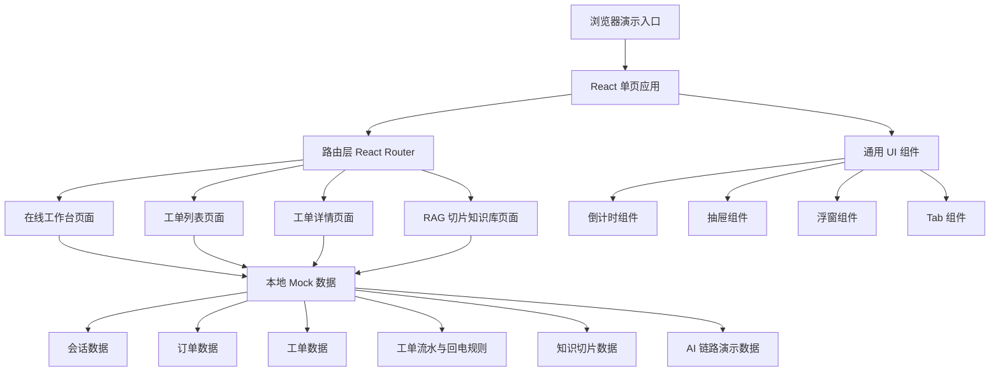

## 1. 架构设计
本 Demo 采用纯前端单页应用架构，所有业务数据、RAG 切片、AI 链路、工单流水和倒计时规则均使用本地 mock 数据模拟，避免依赖真实后端、大模型或 Coze 工作流。



## 2. 技术描述
- **前端框架**：React 18 + TypeScript + Vite。
- **样式方案**：Tailwind CSS 3 + 少量 CSS 变量，构建企业级高密度视觉风格。
- **路由**：React Router DOM，用于在线工作台、工单列表、工单详情、RAG 知识库之间跳转。
- **状态管理**：React hooks 与本地组件状态，复杂全局状态不引入额外库。
- **数据来源**：`src/data/mock.ts` 提供会话、订单、工单、流水、知识切片、AI 链路 mock 数据。
- **倒计时**：前端基于 `targetAt` 时间戳和 `setInterval` 每秒刷新，支持正常、临近、超时、完成状态。
- **交互组件**：自研轻量组件实现 Tab、Drawer、Popover、Modal、Timeline、CountdownBadge。
- **后端服务**：无，所有提交动作前端模拟状态变更或展示 Toast/状态提示。

## 3. 路由定义
| 路由 | 用途 |
|------|------|
| `/` | 默认跳转到在线工作台 |
| `/im` | 在线工作台，包含 IM 对话、智能总结、订单辅助区和建单工具 |
| `/tickets` | 工单列表页，展示秒级回电倒计时和工单概览 |
| `/tickets/:id` | 工单详情页，展示智能方案推荐、工单基础信息、流水和解释浮窗 |
| `/knowledge` | RAG 切片知识库页，展示切片字段、召回场景和文档详情 |
| `/ai-flow` | AI 链路演示页，展示 RAG、React、Self-reflection、最终方案生成 |

## 4. 数据模型

### 4.1 TypeScript 类型定义
```typescript
type CountdownStatus = 'normal' | 'warning' | 'overdue' | 'done';

interface Conversation {
  id: string;
  customerName: string;
  channel: string;
  status: 'waiting' | 'active' | 'closed';
  summary: {
    title: string;
    userDemand: string[];
    merchantRecords: string[];
    ticketRecords: string[];
  };
  messages: Message[];
  orderId: string;
}

interface Message {
  id: string;
  role: 'user' | 'agent' | 'bot' | 'system';
  content: string;
  time: string;
  cardType?: 'order' | 'handoff' | 'evidence';
}

interface OrderInfo {
  id: string;
  productName: string;
  amount: number;
  status: string;
  afterSalesStatus: string;
  merchantName: string;
  logisticsStatus: string;
}

interface Ticket {
  id: string;
  title: string;
  category: string;
  demand: string;
  type: string;
  priority: 'P0' | 'P1' | 'P2';
  status: 'pending' | 'processing' | 'waiting_callback' | 'done' | 'overdue';
  owner: string;
  targetCallbackAt: string;
  lastFlowSummary: string;
  orderId: string;
  solution: SmartSolution;
  flows: TicketFlow[];
}

interface TicketFlow {
  id: string;
  time: string;
  actor: string;
  action: string;
  rule: string;
  countdownChange: string;
  description: string;
}

interface SmartSolution {
  userQuestion: string;
  userDemand: string;
  evidence: string;
  knowledgeRefs: KnowledgeRef[];
  guidance: GuidanceStep[];
  confidence: number;
}

interface KnowledgeChunk {
  id: string;
  documentTitle: string;
  documentSummary: string;
  scene: string;
  chunkContent: string;
  locator: string;
  locatorField: string;
  fullRecallScene: string;
}

interface KnowledgeRef {
  chunkId: string;
  quote: string;
  reason: string;
  confidence: number;
}

interface GuidanceStep {
  id: string;
  conclusion: string;
  action: string;
  briefReasoning: string;
}
```

### 4.2 Mock 数据组织
| 文件 | 内容 |
|------|------|
| `src/data/mock.ts` | 统一导出会话、订单、工单、知识切片、AI 流程数据 |
| `src/utils/countdown.ts` | 倒计时剩余时间、展示状态、格式化函数 |
| `src/utils/rules.ts` | 回电规则模拟，例如外呼后 48h、补充举证后 24h、主管升级后 4h |

## 5. 组件拆分
| 组件 | 责任 |
|------|------|
| `AppShell` | 全局导航、顶部操作区、页面容器 |
| `ConversationList` | 在线工作台左侧会话列表 |
| `SmartSummary` | IM 对话流顶部智能总结 |
| `ChatPanel` | 中央 IM 消息流和输入区 |
| `AssistPanel` | 右侧客服辅助区，承载订单信息 Tab |
| `CreateTicketDrawer` | 建单工具抽屉，展示模型预填字段并允许编辑 |
| `CountdownBadge` | 秒级倒计时展示和状态颜色 |
| `TicketTable` | 工单列表表格 |
| `SmartSolutionCard` | 工单详情页智能方案推荐 |
| `KnowledgePopover` | 知识依据点击浮窗 |
| `ReasoningPopover` | 方案结论点击浮窗，展示简短 COT |
| `TicketTimeline` | 工单流水与回电规则变更 |
| `KnowledgeBasePage` | RAG 切片知识库页面 |
| `AiFlowPage` | 模拟 RAG、React、Self-reflection 链路 |

## 6. 关键交互方案

### 6.1 建单工具
建单工具由在线工作台右侧工具区打开，采用右侧抽屉形式。字段包括工单分类、用户诉求、工单类型、备注，默认值来自 mock 模型输出。字段旁展示“模型预填”和置信度标签，客服可直接修改。

### 6.2 秒级回电倒计时
倒计时组件接收目标回电时间 `targetCallbackAt`，每秒计算剩余时间。剩余时间大于 4 小时为正常，1 到 4 小时为临近，小于 0 为超时，工单完成后为已完成。工单列表和工单详情标题左侧复用同一组件。

### 6.3 工单流水触发规则
示例规则全部静态模拟：
- 外呼自动完成：生成一轮 48h 回电倒计时。
- 用户补充举证：触发“证据待核实”规则，倒计时改为 24h。
- 商家拒绝退款：触发“争议升级”规则，倒计时改为 12h。
- 主管升级：触发“高优先级回电”规则，倒计时改为 4h。
- 客服完成处理：取消回电倒计时并标记完成。

### 6.4 RAG 切片知识库
知识库页面用表格 + 详情侧栏展示切片字段。工单详情的知识依据引用可跳转或定位到对应切片，演示“方案不是凭空生成，而是来自可追踪知识”。

### 6.5 React 与 Self-reflection 展示逻辑
由于 Demo 不接真实模型链路，使用“可解释流程面板”模拟：
- **RAG 阶段**：展示查询改写、召回切片、匹配原因、引用置信度。
- **React 阶段**：展示 Thought/Action/Observation 的业务化版本，例如“判断是否满足退款举证”“查询售后规则”“观察商家拒绝原因”。界面可命名为“行动轨迹”，避免对外展示过长内部思维。
- **Self-reflection 阶段**：展示模型自检项，如“证据是否充分”“方案是否违反 SLA”“是否遗漏回电规则”“是否需要升级主管”，并展示修正前后方案。
- **最终方案**：将检索依据、行动轨迹和自检修正合并成客服可执行指引。

## 7. 质量与演示约束
- 所有页面必须可点击跳转，避免只有静态截图感。
- 核心卡片、倒计时、浮窗、抽屉、Tab 和步骤流必须有真实交互。
- 不接外部接口，不依赖真实大模型，确保演示稳定。
- 文案应偏业务真实，避免空泛 AI 术语堆砌。
- 视觉上保持信息密度，但通过卡片层级、颜色、间距和分区降低理解成本。
